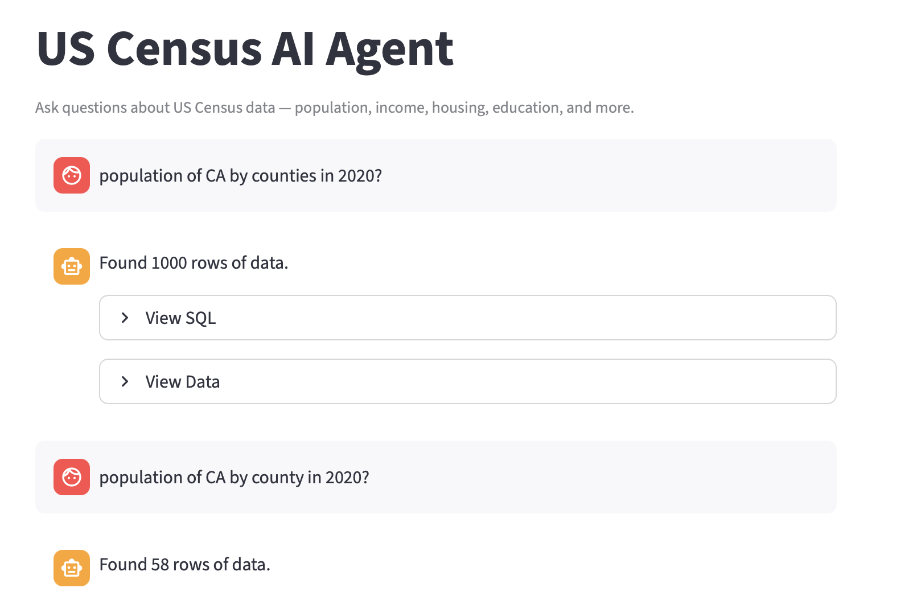

# Census Text-to-SQL Agent (v1.0)

Link to demo: [The AI Agent](https://census-text2sql-agent.streamlit.app/)

Introducing the **Census Text-to-SQL Agent** that translates Natural Language to Snowflake SQL using Snowflake Cortex AI to query the [US Open Census Dataset](https://urldefense.com/v3/__https://app.snowflake.com/marketplace/listing/GZSNZ2UNN0/safegraph-us-open-census-data-neighborhood-insights-free-dataset__;!!Mih3wA!AG7RCvE7t1U1XHb-7iplJr8rPXnz4G9mOp6yyv5_DD06CjntJ7XWjZpOMqTi-9A-ePe2m-ZMumwmLa3r5bxN8b4LlA8$) available for free on Snowflake marketplace.


## Key Features

1. An interactive chat-based agent that can answer natural language questions based on this data set
2. Does not hallucinate when off topic questions are asked, does not give answers if the question / query is not related to the dataset or Not safe for work (NSFW)
3. Heuristically maps queries to the correct Census Subject Tables and specific years (2019, 2020 available in the marketplace)
4. Leverages `mistral-large2` via the `SNOWFLAKE.CORTEX.AI_COMPLETE` to ensure performant and safe sql generation
5. Post processes LLM hallucinated outputs to handle failures when output contains markdown, escaped quotes, newlines etc.
6. SQLAlchemy Data access ensures robust connection pooling and URL encoded connection handling to prevent failures 
7. Preserves context by tracking geography, subject and query intent across follow up questions
8. Intelligently handles follow up questions that could sound off topic;
For eg: 
```
You: What is the total income for CA in 2019? 
Results:
    total_income
0  1394602475300

You: What about in 2020? # this sounds off topic since there is no mention of a state or county
Results:
   total_income_2020
0       1.462390e+12
```
9. Retrieves results for every query within 60 seconds

## Flowchart of how it works

```
User types query in Streamlit UI
        │
1. app.py               validates password, renders chat UI,
                        persists Thought Process + SQL + results
                        across conversation history
        │
2. main.py              orchestrates the full pipeline,
                        manages conversation history across turns,
                        GUARDRAIL: is_census_related() fires here —
                        off-topic and NSFW queries rejected before
                        any Snowflake connection is made
        │
3. extractor.py         extracts geography ("CA"), year ("2020")
                        from natural language using multi-stage parsing
        │
4. geography.py         resolves state/county name => FIPS prefix
                        e.g. "California" / "CA" => "06"
        │
5. router.py            maps query keywords => Census subject code
                        e.g. "income" => B19
                        detects aggregate / median / breakdown intent
                        detects multi-table queries (e.g. income + race)
                        sets is_county_breakdown / is_state_breakdown flags
        │
6. src/prompt/          builds dynamic system prompt:
   ├── instructions.py    geo filter, aggregation rules, breakdown SQL template,
   │                      multi-table JOIN instructions
   ├── rules.py           SUBJECT_AGG_RULES (all B01–B99 codes),
   │                      SUBJECT_ALIASES for deterministic column aliasing
   └── sections.py        assembles final prompt string,
                          injects live schema hints (estimate columns only)
        │
7. agent.py             sends system prompt + user query to
                        Cortex (mistral-large2) via AI_COMPLETE,
                        post-processes SQL output:
                          strips markdown / backticks
                          removes escaped quotes
        │
8. database.py          executes cleaned SQL via SQLAlchemy
                        connection pool, returns pandas DataFrame
        │
9. main.py              updates conversation history,
                        returns { answer, sql, results, routing,
                                  fips, state, county }
        │
10. app.py              renders assistant response:
                          Thought Process expander (persists in history)
                          SQL expander
                          results dataframe
```


---

## Quick Start
### 1. Pre-requisites 
* Python 3.9+
* Snowflake account with access to `US_OPEN_CENSUS_DATA__NEIGHBORHOOD_INSIGHTS__FREE_DATASET`

### 2. Installation Steps
``` 
    git clone <url>
    cd census-text2sql-agent
    pip install -r requirements.txt
```

### 3. Configuration Settings
Create an `.env` file in the root directory by following instructions in [`.env.example`](./.env.example) file
```
    cp .env.example .env
```

### 4. Usage 

#### CLI 
```
    # Single query mode
    python cli.py "What is the population of San Diego in 2020?"

    # Verbose/debug mode
    python cli.py "Median income in Cook County for 2019" -v

    # Interactive multi-turn mode
    python cli.py
```

#### Streamlit UI
```bash
streamlit run app.py
```

#### Web based interface

Click on [this link](https://census-text2sql-agent.streamlit.app/) and enter the demo password that has been shared with the recruiter on email. 

Please contact ktank@ucsd.edu if you still cannot access this demo.

---

## Running Tests
```bash
pytest tests/
```

---

## Project Structure
```
.
├── app.py                        # Streamlit web UI entry point containing: chat, thought process, sql, results
├── cli.py                        # CLI entry point, argument parsing & interactive loop
├── main.py                       # Core orchestration logic, guardrail triggered & conversation history management
├── src/
│   ├── agent.py                  # Cortex AI inference & SQL sanitization
│   ├── database.py               # SQLAlchemy connection pooling & query execution
│   ├── extractor.py              # Multi-stage geographic entity extraction
│   ├── geography.py              # FIPS code resolution for states & counties
│   ├── router.py                 # Heuristic routing to Census subject tables
│   ├── schema_discovery.py       # Live column fetching from Snowflake (lru_cache)
│   └── prompt/
│       ├── __init__.py           # Public API — exposes get_system_prompt()
│       ├── instructions.py       # Geo / agg / breakdown / multi-table instruction builder functions 
│       ├── rules.py              # SUBJECT_AGG_RULES (B01–B99), SUBJECT_ALIASES
│       └── sections.py           # Assembles final prompt string
├── tests/
│   └── test_router.py            # Unit tests for subject table routing
    └── test_extractor.py         # Unit tests for exttractor function extracting state, county
    └── test_get_system_prompt.py # Unit tests for getting system prompt
    └── test_fips_resolver.py     # Unit tests for fips resolver which fetches FIPs code for state and county
├── .env.example                  # Template for environment variables
├── requirements.txt              # Pinned dependencies
└── .pre-commit-config.yaml       # black + ruff pre-commit hooks
```

## Development Process

### 1. Management of dependencies 
**Environment Parity via pinned dependencies:** I pinned all dependencies in requirements.txt via `pip freeze` to make sure the agent remains functional across deployment envs preventing any breaking changes due to upstream library updates

**Minimalist Dependency Footprint:** I removed `openai` SDK entirely after migrating to Snowflake-native inference at the start of the project, reducing external library overhead by ~20%. This resulted in faster installs and keeps third-party dependencies minimal

---

### 2. Routing Strategy 
**Keyword to Subject Code Mapping**: I have a semantic routing layer in place to map natural language key words to official subject codes (for eg: `income` => `B19`). This way we dont need to include the entire schema in the LLM window 

**Inherit Context from previous turns**: I impelemented context aware routing by accepting prior subject codes, if the previous turn was an aggregation or median, any prior additional tables relevant to context, from `main.py` for efficient routing

**Multi Table Join Detection**: I have handled this in `router.py` where if the query spans multiple subject codes, additional tables are then merged with prior tables if any, from prior turns (history)

---

### 3. Prompt Engineering

**Prompt module for generating system prompt**:`src/prompt/` is split into four focused files:
  - `instructions.py` which builds geo filter, aggregation, breakdown SQL template, and multi-table JOIN instruction strings
  - `rules.py` which consists of `SUBJECT_AGG_RULES` covering all subject codes `B01`–`B99`, and `SUBJECT_ALIASES` for deterministic column aliasing (e.g. `total_income`) so the LLM never has to infer a meaningful alias
  - `sections.py` that orchestrates all instruction blocks into the final prompt string, fetches live schema hints via `schema_discovery.py`, and filters to estimate columns only using `re.match(r'^B\d+e\d+')`
  - `__init__.py` which houses the public API, exposes `get_system_prompt()` so all callers have a single import point
- `schema_discovery.py` uses `@lru_cache(maxsize=32)` hence Snowflake schema fetch happens once per table per process lifetime

--- 

### 4. Guardrails

**Checks implemented in main.py**: Fired before any snowflake connection is made, where off topic and not safe for work queries are rejected 

**Validation of year**: Any query mentioning years beyond 2020 or before 2019 are flagged as out of scope as the dataset available on Snowflake marketplace doesn't contain data from years before 2019 and after 2020. 

### 5. Architecture and Inference 

**Strategic Transition to Snowflake Cortex:** I moved the project from OpenAI to Snowflake’s native Cortex AI (mistral-large2). I did this for three main reasons:
- **Data Safety**: it keeps schema metadata within Snowflake
- **Performance**: it’s faster because there’s no network lag to an external API,
- **Operational Reliability:** I don't have to worry about external API limits or quotas

**Inference Engine Resilience:** During testing, I ran into some regional errors (Error 100351) where certain models weren't available in my Snowflake region. To fix this, I used mistral-large2 as my primary engine. It’s just as good at writing SQL but is much more reliable across different Snowflake regions, so the app doesn't break depending on where it’s deployed

**Conversation History**: I managed conversation state by passing a conversation_history list into the main pipeline. Instead of using messy global variables, the list is updated in place after every turn. Each entry stores key details like the resolved state, county, and subject codes. If a user asks a follow-up like "What about 2020?", the system looks backward through the history to find the most recent geographic context. 

**Thought Process UI**: To keep the UI consistent, I saved the routing details, FIPS codes, and geographic data directly into each message within the Streamlit session state. I created a helper function called render_thought_process() that handles the display for both new queries and the chat history. This helps the user **trust the AI** by looking at how it is querying through the database.

---

### 6. Version Control and Branching Strategy

**Commits format**: I followed the  standard for all my commit messages. This makes the project history a lot easier to read by labeling changes with tags like feat: for new features, fix: for bug fixes, and docs: for documentation

**Atomic Commit Strategy**: I made sure to group the core parts of the project, like the environment setup, database connection, and the routing logic, into logical chunks. The commit history thus reflects a logical build-up 

**Feature Branch Workflow**: Once the basic setup was on the main branch, I moved all new work to separate feature branches. This keeps main stable and ready to run at all times. Riskier changes like prompt engineering were isolated in feature branches before merging

**Precommit checks**: I put some precommit checks in place in the `.pre-commit-config.yaml` file to ensure clean code

---

### 7. Developer Experience & Security
**Fail-Fast Credential Loading:** I set up the project to check for all required environment variables right when it starts. This "fail-fast" approach means that if a Snowflake password or username is missing, the app stops immediately and gives a clear error message instead of crashing later with a confusing traceback

**Onboarding via `.env.example`:** A `.env.example` template gives new contributors a clear template for required secrets, making the project easily portable and ensuring sensitive secrets are never committed to version control


## Things I would do differently if I had more time

### 1. Replace keyword mapping with embedding-based routing
This would ensure synonyms for income like wages etc. would still map to the right subject code using semantic similarity 

For example: 



I tried to retrive breakdown by counties but since I have mapped it specifically to a list mentioned [in this file](./src/prompt.py) , it only contains breakdown "by county" and not "by counties" when both are semantically same. 

### 2. ~~Schema Discovery~~
~~Currently the routing for subject code is hardcoded, if I had mroe time I would build a route map dynamically (just one time), from the live schema. This way in case new columns are added to the database the agent would stay in sync~~

### ~~3. Multi table joins~~
~~Currently the agent is unable to query multiple tables, for eg: income for various ethinicites in a particular county or state.~~

~~To fix this, the router would need to detect when a query spans multiple subject codes (e.g., `B19` for income + `B02` for race) and return all matched codes instead of just one. The system prompt would then instruct the LLM to `JOIN` those tables on their shared `GEOID` column. The main challenge is that the LLM needs to know which columns exist in each table to write a valid join, so this would also depend on having some form of schema discovery (point 2 above) in place first~~

### 4. Schema hints 

Column-level hints within each table are still hardcoded in [`prompt.py`](./src/prompt.py). If new columns are added to an existing table, the agent won't dynamically pick them up 

### 5. Dynamic Column level hints 

Right now, the column names in `SUBJECT_AGG_RULES` are hardcoded (for example, mapping B19001e14 to the $100k-$125k income bracket). If the dataset is updated or new columns are added, the agent won't know they exist without a manual code change.

To fix this, I would implement a startup check that pulls column descriptions directly from INFORMATION_SCHEMA.COLUMNS. By using those official descriptions to automatically generate the bracket mappings, the agent would stay in sync with the live database and I wouldn't have to maintain these mappings by hand.

### 6. Semantic Result caching

Currently if the user asks "total income in CA for 2020?" and then asks "what is the combined income in CA for the year 2020?"; it would end up querying the db twice when this result can be easily cached and referred to later to answer identical intents 

I would implement a Semantic Cache using Snowflake Dynamic Tables and Vector Data Types. By pre-materializing common query embeddings into a Dynamic Table, the agent could perform a distance-based similarity search to return results for repeated questions instantly

### 7. Self correction loop 

I would implement a Self-Correction Loop where, if a Snowflake execution fails, the error message is fed back to the LLM. The AI agent would then analyze the error and rewrite the SQL to retry execution. 

### 8. Add ability to detect multiple locations in query to perform comparison analysis 

### **Strikethroughs Implemented** 

Router can now detect multiple subject codes per query, merges inherited tables across conversation turns, and the prompt injects multi-table JOIN instructions with aliased schema hints 
